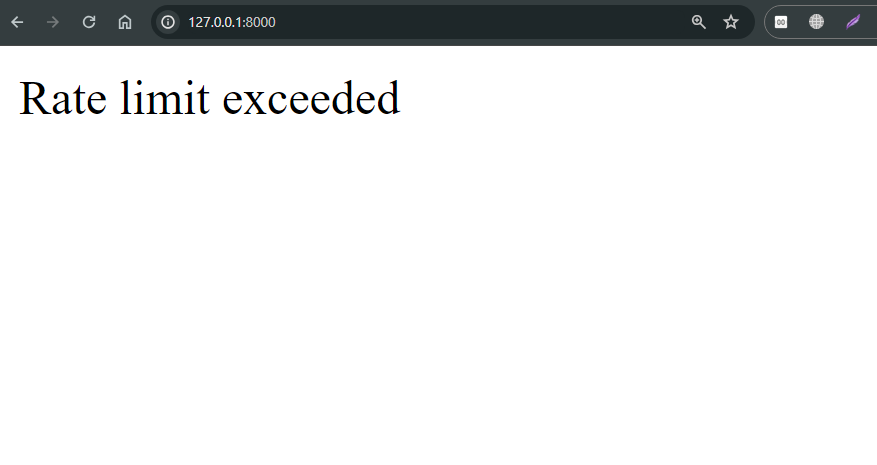

# Exploring Middleware and Creting Custom Middleware

## Custom Middleware

**Limit Request of a Specific IP Address**

```python
class RateLimitMiddleware(MiddlewareMixin):
    def __init__(self, get_response=None):
        super().__init__(get_response)

    def process_request(self, request):
        # Get the client's IP address
        ip_address = request.META.get('REMOTE_ADDR')

        # Define the rate limit parameters
        limit = 100  # Max requests per minute
        period = 60  # Time window in seconds

        # Generate a unique key for the client's IP address
        key = f'ratelimit:{ip_address}'

        # Get the current count of requests from the cache
        count = cache.get(key, 0)

        # If the count is above the limit, reject the request
        if count >= limit:
            return HttpResponseForbidden("Rate limit exceeded")

        # Increment the count and update the cache
        cache.set(key, count + 1, period)

        # Add a custom header to the response indicating the remaining requests
        remaining_requests = limit - (count + 1)
        response = self.get_response(request)
        response['X-RateLimit-Remaining'] = str(remaining_requests)

        return None
```

